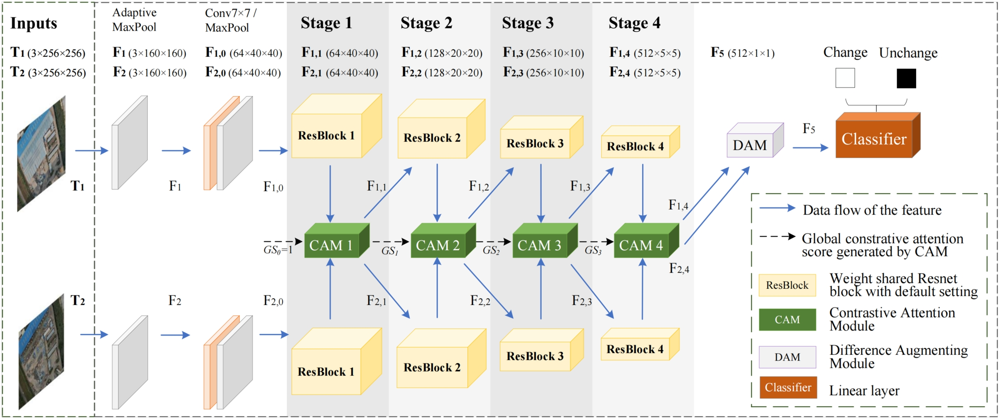

# CAS-Net

This is the official repository for “CAS-Net: Comparison-Based Attention Siamese Network for Change Detection With an Open High-Resolution UAV Image Dataset”. The repo is based on Pytorch.

## Abstract

Change detection (CD) is a process of extracting changes on the Earth’s surface from bitemporal images. Current CD methods that use high-resolution remote sensing images require extensive computational resources and are vulnerable to the presence of irrelevant noises in the images. In addressing these challenges, a comparison-based attention Siamese network (CAS-Net) is proposed. The network utilizes contrastive attention modules (CAMs) for feature fusion and employs a classifier to determine similarities and differences of bitemporal image patches. It simplifies pixel-level CDs by comparing image patches. As such, the influences of image background noises on change predictions are reduced. Along with the CAS-Net, an unmanned aerial vehicle (UAV) similarity detection (UAV-SD) dataset is built using high-resolution remote sensing images. This dataset, serving as a benchmark for CD, comprises 10000 pairs of UAV images with a size of 256×256 . Experiments of the CAS-Net on the UAV-SD dataset demonstrate that the CAS-Net is superior to other baseline CD networks. The CAS-Net detection accuracy is 93.1% on the UAV-SD dataset. The code and the dataset can be found at https://github.com/WenbaLi/CAS-Net .



## Requirements
- Ubuntu 18.04
- Python 3.8
- pytorch 1.13.0
  

## UAV-SD dataset

UAV-SD dataset is available. Please contact Yikui Zhai at yikuizhai@163.com.


## Citation

Please cite this if you want to use it in your work.

```
@ARTICLE{Yikui Zhai,
  title={CAS-Net: Comparison-Based Attention Siamese Network for Change Detection With an Open High-Resolution UAV Image Dataset}, 
  author={Yikui Zhai, Wenba Li, Tingfeng Xian, Xudong Jia, Zijun Tan, Jianhong Zhou, Junying Zeng and C. L. P. Chen},
  journal={IEEE Transactions on Geoscience and Remote Sensing}, 
  year={2024},
  volume={62},
  number={5619617},
  pages={1-17},
  doi={10.1109/TGRS.2024.3386918}
}
```
